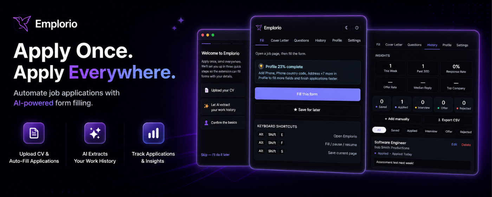

<h1 align="center">
  <a href="https://emplorio.co.uk">
    
    
  </a>
  <br>
  Emplorio
</h1>

<p align="center">
  <b>Apply once. Send everywhere.</b><br>
  An AI-powered Chrome extension that auto-fills job applications across every major ATS,<br>
  drafts tailored cover letters with Claude, and tracks every application — in seconds, not minutes.
</p>

<p align="center">
  <a href="https://emplorio.co.uk"></a>
  
  
  
</p>

<p align="center">
  
  
  
  
  
  
  
  
  
</p>

<p align="center">
  <a href="https://emplorio.co.uk">
    
  </a>
</p>

<p align="center">
  <a href="#what-it-does">What it does</a> ·
  <a href="#supported-ats-platforms">Supported ATSes</a> ·
  <a href="#tech-stack">Tech stack</a> ·
  <a href="#getting-started">Getting started</a> ·
  <a href="#privacy--data">Privacy</a> ·
  <a href="#design--tooling">Design</a> ·
  <a href="#roadmap">Roadmap</a>
</p>

---

## The problem

Serious job hunters fill the same 20 fields — name, email, phone, work authorisation, previous roles, EEO questions — across 10+ applications a day. Each one takes 20–40 minutes of copy-paste tedium, *before* writing a custom cover letter or reshaping the CV. Applying to 100 roles costs 40+ hours of pure form-filling.

## The solution

A Chrome extension that knows your profile and fills any job application form on detection, plus a small sync service that keeps your profile, applications, and AI drafts in step across devices. The LLM (Claude) is grounded in your real CV — it rewrites and emphasises; it never invents.

---

## What it does

### Smart autofill across 9 ATS platforms

Click once and every field on a job application populates in under a second. Three-layer detection strategy:

1. **ATS adapters** — bespoke selectors per platform
2. **Generic heuristics** — `autocomplete` → `name`/`id` → adjacent `<label>` text against the profile schema
3. **LLM fallback** — for unknown forms, serialises field labels and asks Claude for a mapping. Cached per-domain, so the model runs once per new site

### AI cover letters, question answers & follow-ups *(BYO Anthropic key)*

| Action | Input | Output |
|---|---|---|
| **Cover letter** | Job description + your profile + tone | Streamed cover letter from Claude |
| **Question answer** | "Why this role?" + your CV | Drafted answer in your voice |
| **Follow-up email** | Application + days elapsed | Polished follow-up |
| **CV extraction** | A PDF you drop in once | Structured profile fields |

The Anthropic key lives **only** in `chrome.storage` on your device. When you trigger an AI action it's sent on a single request, used to call Anthropic on your behalf, and discarded server-side. Never logged, never persisted.

### Application tracking + cross-device sync

Every application logs automatically — company, role, URL, status, JD snapshot, timestamps. Sign in with a magic-link OTP and everything syncs across browsers via Postgres in the EU.

### Privacy-first by design

- Bring your own AI key — Emplorio never bills you, never holds it
- All data in the EU (Neon / Frankfurt) and London (Fly.io / `lhr`)
- No analytics, no tracking pixels, no advertising
- Scoped permissions — no `https://*/*`, only the ATS sites the extension supports

---

## Supported ATS platforms

<details open>
<summary><b>9 platforms · click to expand</b></summary>

| ATS | Status | File |
|---|---|---|
| Greenhouse | ✅ | [`adapters/greenhouse.ts`](apps/extension/src/adapters/greenhouse.ts) |
| Lever | ✅ | [`adapters/lever.ts`](apps/extension/src/adapters/lever.ts) |
| Workday | ✅ | [`adapters/workday.ts`](apps/extension/src/adapters/workday.ts) |
| Ashby | ✅ | [`adapters/ashby.ts`](apps/extension/src/adapters/ashby.ts) |
| LinkedIn (Easy Apply + hiring) | ✅ | [`adapters/linkedin.ts`](apps/extension/src/adapters/linkedin.ts) |
| Indeed (+ smartapply) | ✅ | [`adapters/indeed.ts`](apps/extension/src/adapters/indeed.ts) |
| Workable | ✅ | [`adapters/workable.ts`](apps/extension/src/adapters/workable.ts) |
| SmartRecruiters | ✅ | [`adapters/smartrecruiters.ts`](apps/extension/src/adapters/smartrecruiters.ts) |
| iCIMS | ✅ | [`adapters/icims.ts`](apps/extension/src/adapters/icims.ts) |

Anything not listed falls back to generic heuristics + the Claude-driven mapper.

</details>

---

## Keyboard shortcuts

| Shortcut | Action |
|---|---|
| <kbd>Alt</kbd> + <kbd>Shift</kbd> + <kbd>E</kbd> | Open the Emplorio popup |
| <kbd>Alt</kbd> + <kbd>Shift</kbd> + <kbd>F</kbd> | Fill the current form |
| <kbd>Alt</kbd> + <kbd>Shift</kbd> + <kbd>S</kbd> | Save the current job to history |

---

## Tech stack

<table>
<tr>
  <th align="left">Layer</th>
  <th align="left">Choice</th>
  <th align="left">Why</th>
</tr>
<tr>
  <td><b>Extension</b></td>
  <td>TypeScript · React 18 · Vite · <code>@crxjs/vite-plugin</code> · Manifest V3</td>
  <td>Modern MV3 DX, shared types with backend, MV3-CSP compliant (no inline scripts)</td>
</tr>
<tr>
  <td><b>Web</b></td>
  <td>Next.js 15 · React 18 · vanilla CSS · Radix UI</td>
  <td>App Router, RSC where it helps, no framework bloat for a marketing site</td>
</tr>
<tr>
  <td><b>API</b></td>
  <td>Fastify on Node 22 · Docker</td>
  <td>Real server (not serverless) — middleware, streaming, long-running</td>
</tr>
<tr>
  <td><b>ORM</b></td>
  <td>Drizzle</td>
  <td>SQL-first, strong TS inference</td>
</tr>
<tr>
  <td><b>Database</b></td>
  <td>Neon Postgres (EU)</td>
  <td>Serverless Postgres with branching</td>
</tr>
<tr>
  <td><b>Auth</b></td>
  <td>Magic-link OTP → JWT cookie + bearer</td>
  <td>No third-party auth provider; user data stays here</td>
</tr>
<tr>
  <td><b>Hosting</b></td>
  <td>Vercel (web) · Fly.io London (API)</td>
  <td>Persistent container for the API, edge for the marketing site</td>
</tr>
<tr>
  <td><b>Email</b></td>
  <td>Resend</td>
  <td>OTP delivery, simple SDK</td>
</tr>
<tr>
  <td><b>AI</b></td>
  <td>Anthropic Claude (<code>@anthropic-ai/sdk</code>)</td>
  <td>Streaming, prompt caching for the profile half of every request</td>
</tr>
<tr>
  <td><b>Tests</b></td>
  <td>Vitest</td>
  <td>Fast, native ESM, integrated with the monorepo</td>
</tr>
</table>

### Repo layout

```
emplorio/
├── apps/
│   ├── extension/         # MV3 Chrome extension
│   │   ├── src/adapters/  # 9 ATS adapters
│   │   ├── src/lib/       # autofill engine, AI client, scrape, sync, settings, theme
│   │   ├── src/popup/     # React popup UI
│   │   └── src/content/   # content script entry
│   ├── api/               # Fastify server
│   │   └── src/routes/    # /auth /profile /applications /generate /field-mappings
│   └── web/               # Next.js marketing site (emplorio.co.uk)
└── packages/
    ├── shared/            # Zod schemas, types, ProfileKey enum
    └── db/                # Drizzle schema + migrations
```

### Architecture

```
┌────────────────┐    HTTPS + bearer/cookie    ┌──────────────────┐
│  Chrome Ext    │ ──────────────────────────▶ │   Fastify API    │
│  (popup +      │                              │   (Fly.io / lhr) │
│   content)     │ ◀──────────────────────────  │                  │
└───────┬────────┘                              └────┬─────────────┘
        │                                            │
        │ chrome.storage (profile cache)             │
        ▼                                            ▼
   user's device                              Neon Postgres (EU)

┌────────────────┐
│  emplorio.co.uk│  Static marketing + privacy + terms (Vercel)
└────────────────┘
```

---

## Getting started

### Prerequisites

- Node.js ≥22
- pnpm 9
- A Postgres database (Neon free tier works)
- A Resend API key for OTP delivery

### Local dev

```bash
# 1. Install
pnpm install

# 2. Environment
# create a .env in the repo root with DATABASE_URL, JWT_SECRET, RESEND_API_KEY,
# ANTHROPIC_API_KEY, REDIS_URL, etc. See apps/api/src/env.ts for the full schema.

# 3. Database
pnpm db:migrate

# 4. Run everything in parallel
pnpm dev
# → API on :3001, web on :3000, extension watcher

# 5. Load the extension
# chrome://extensions → Developer mode → Load unpacked → apps/extension/dist
```

### Production builds

```bash
# Web (Vercel auto-deploys from main)
pnpm --filter @emplorio/web build

# API (Fly.io — see apps/api/fly.toml)
cd apps/api && fly deploy

# Extension (zip apps/extension/dist for the Chrome Web Store)
VITE_API_ORIGIN=https://emplorio-api.fly.dev pnpm --filter @emplorio/extension build
```

### Useful scripts

```bash
pnpm typecheck             # tsc --noEmit across the monorepo
pnpm test                  # vitest, all workspaces
pnpm db:studio             # Drizzle Studio against your DATABASE_URL
pnpm db:generate           # generate a new migration from schema changes
```

<details>
<summary><b>Environment variables · click to expand</b></summary>

| Variable | Where | Purpose |
|---|---|---|
| `DATABASE_URL` | api | Neon Postgres connection string |
| `JWT_SECRET` | api | ≥32 chars; signs session tokens |
| `RESEND_API_KEY` | api | OTP email delivery |
| `EMAIL_FROM` | api | Sender for OTP emails |
| `WEB_ORIGIN` | api | CORS allow origin (e.g. `https://emplorio.co.uk`) |
| `COOKIE_DOMAIN` | api | e.g. `emplorio.co.uk` in prod |
| `ANTHROPIC_API_KEY` | api *(optional)* | Server-owned fallback key — users normally bring their own |
| `ANTHROPIC_MODEL` | api | Defaults to `claude-opus-4-7` |
| `EMPLORIO_API_KEY` | api + extension | Optional shared secret to gate the API |
| `VITE_API_ORIGIN` | extension build | Production API URL baked into the bundle |

</details>

---

## Privacy & data

See [emplorio.co.uk/privacy](https://emplorio.co.uk/privacy) and [emplorio.co.uk/terms](https://emplorio.co.uk/terms) for the full policy.

**Short version:**

| | Stored |
|---|---|
| 🇪🇺 **Database (Neon, EU)** | Sign-in email, profile fields, application history, generated drafts, settings |
| 🖥️ **Your device only (`chrome.storage`)** | Anthropic API key, theme preference, in-progress sign-in state |
| ❌ **Never collected** | Payment info, location, browsing history, telemetry |
| 🤝 **Third parties** | Neon (database), Fly.io (API), Resend (email), Anthropic (only with your key) |

---

## Design & tooling

The visual language, brand mark, marketing site, and Chrome Web Store assets were built with help from:

| Tool | Used for |
|---|---|
| [**21st.dev**](https://21st.dev) | Component patterns and React/Tailwind reference snippets |
| [**Midjourney**](https://www.midjourney.com) | Brand exploration, concept art, illustration drafts |
| [**Figma**](https://www.figma.com) | Layout, spacing, and the bento-grid feature wall |
| [**Heroicons**](https://heroicons.com) · [**Lucide**](https://lucide.dev) · [**Simple Icons**](https://simpleicons.org) | All inline SVG icons (no emoji, no icon-font weight) |
| [**Inter**](https://rsms.me/inter/) · [**Bricolage Grotesque**](https://fonts.google.com/specimen/Bricolage+Grotesque) | Typography pairing |
| [**Coolors**](https://coolors.co) | Indigo / purple gradient palette tuning |
| [**Radix UI**](https://www.radix-ui.com) | Accessible accordion + primitives in the marketing site |
| [**Vercel**](https://vercel.com) · [**Fly.io**](https://fly.io) · [**Neon**](https://neon.tech) · [**Resend**](https://resend.com) | Hosting, database, transactional email |

Brand identity: indigo `#4f46e5` → violet `#818cf8` gradient on a warm dark `#0b0a18` canvas. Dark mode is the default; light mode is hand-tuned with warm-ink shadows rather than flat slate.

### Built with Claude

This project — every line of TypeScript, the Drizzle schema, the Fastify routes, the Next.js marketing site, the autofill engine, the 9 ATS adapters, the popup UI, the brand identity prompts, the CSS, the CWS submission copy, even this README — was paired with **[Claude](https://claude.ai)** ([Anthropic](https://www.anthropic.com)) using **[Claude Code](https://www.anthropic.com/claude-code)**. Months of solo work compressed into weeks. Couldn't have shipped this alone — full credit where it's due.

---

## Roadmap

- [x] **MV1** — Greenhouse + Lever adapters, profile editor, local storage
- [x] **v1.0** — 9 ATS adapters · API + auth + cloud sync · AI cover letters / answers / follow-ups · CV extraction · application tracking · marketing site · privacy/terms · Chrome Web Store submission
- [ ] **v1.1** — Auto-Apply mode (opt-in, rate-limited) · response-rate analytics per CV variant · more ATS adapters
- [ ] **v2** — Smart job matching (Adzuna / JSearch APIs) · tailored CV PDF export · team / agency mode

---

## Why it stands out

- **Browser extension engineering** — Manifest V3, content scripts, cross-context messaging, MV3-compliant CSP (no inline scripts)
- **Real backend** — hand-written Fastify on Docker, not BaaS
- **LLM product thinking** — streaming, prompt caching, BYO-key model that aligns incentives, grounded generation that never invents
- **Privacy discipline** — sensitive PII handling, scoped permissions (no `https://*/*`), no logging of profile data, EU-only storage
- **Product sense** — Co-Pilot as default, Auto-Apply as opt-in; restraint over flash

---

<p align="center">
  <a href="https://emplorio.co.uk"><b>emplorio.co.uk</b></a> ·
  <a href="https://emplorio.co.uk/privacy">Privacy</a> ·
  <a href="https://emplorio.co.uk/terms">Terms</a> ·
  <a href="mailto:emplorioEXT@gmail.com">Contact</a>
</p>

<p align="center">
  <sub>Built while job hunting · used on the roles I'm interviewing for right now · saved me 40+ hours.</sub>
</p>
